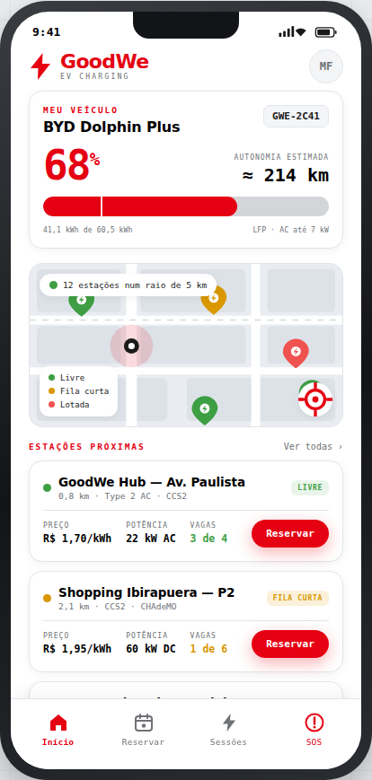
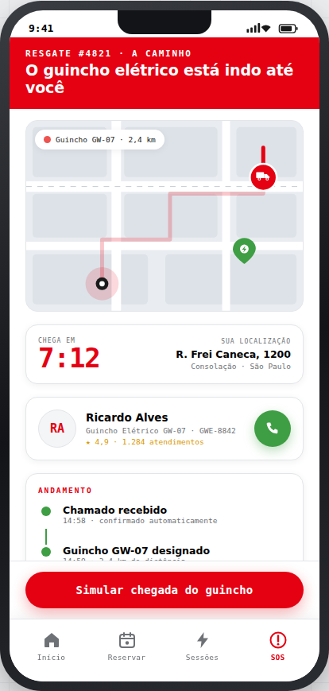
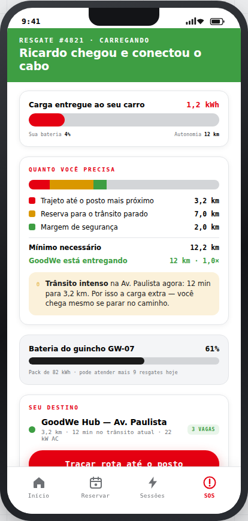

## Arquitetura do Sistema

O projeto adota uma arquitetura desacoplada **Cliente-Servidor**:
- **Backend (API):** FastAPI gerenciando lógica de negócios, balanceamento de potência e cobrança.
- **Frontend (Totem):** Flet (Python/Flutter) operando em Modo Totem.

**[Ler a Documentação Arquitetural Completa](docs/ARQUITETURA.md)**

## Como Executar o Projeto

**Pré-requisitos:** Instale as dependências executando `pip install fastapi uvicorn requests pydantic flet`.

1. **Inicie a API:** Em um terminal, acesse a pasta `api/` e rode:
    ```bash
    uvicorn main:app --reload
    ```
2. **Inicie o Totem:** Em um segundo terminal, acesse a pasta totem/ e rode:
    ```bash
    flet run flet_proposta_gw.py
    ```

## App do Motorista (`booking-app/`)

Além do Totem, o projeto tem um **app mobile do motorista**: protótipo navegável em arquivo único, sem build.

<p align="center">
  
  
  
</p>

Quatro abas: **Início** (bateria, autonomia, mapa e estações próximas), **Reservar** (fluxo de 3 etapas até o QR), **Sessões** (carga ativa e histórico) e **SOS — Resgate Elétrico** (guincho elétrico com rastreio em tempo real e carga dimensionada para o trânsito).

```bash
python -m http.server 8080   # depois acesse http://localhost:8080/booking-app/
```

Detalhes de telas e integração pendente com a API: [`booking-app/README.md`](booking-app/README.md).
Cores e tipografia compartilhadas com o totem: [`docs/DESIGN_SYSTEM.md`](docs/DESIGN_SYSTEM.md).
